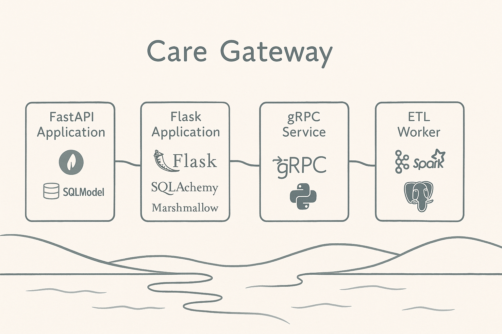
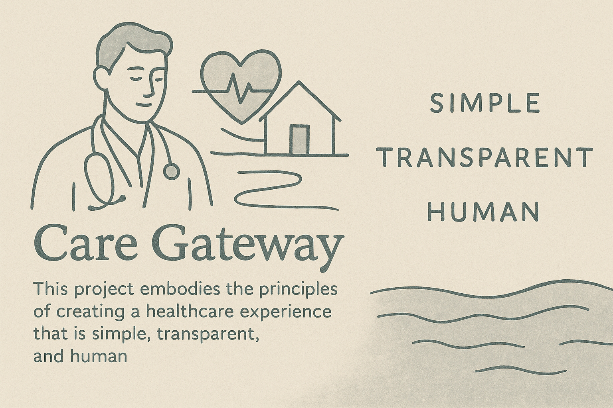

<p align="center">
  <a href="./SECURITY.md"></a>
  <a href="./LICENSE"></a>
  <a href="http://daviguides.github.io"></a>
  <a href="https://daviguides.github.io/articles/devsecops/2025/04/25/zero-trust-manifest.html"></a>
  <a href="https://daviguides.github.io/keysentinel/"></a>
  
  
</p>

# 🩺 Care Gateway: All-in-One Portfolio Project




**Care Gateway** is a modular, full-stack backend simulating healthcare claim workflows — built to showcase real-world skills in **APIs**, **gRPC**, **ETL**, and **streaming**.

It integrates **PostgreSQL**, **Kafka**, **PySpark**, and Python frameworks (Flask, FastAPI) in a clean, cloud-ready architecture.
Ideal for demonstrating expertise in **Python**, **API design**, and **data engineering**.

The project emphasizes simplicity, transparency, and human-centered design—mirroring values found in modern healthtech platforms. Each component is crafted to reflect practical scenarios, from claim ingestion to real-time processing, with clear structure and extensibility.

## ⭐ My Related Projects

- 🔗 [sftp2s3](https://github.com/daviguides/sftp2s3): Syncs files from SFTP to S3 — ideal for upstream EDI flow.
- 🔗 [sftp-aws-cdk-infra](https://github.com/daviguides/sftp-aws-cdk-infra): Provisions AWS Transfer Family SFTP with AWS CDK — secure ingestion pipelines.
- 🔗 [keysentinel](https://github.com/daviguides/keysentinel): Local token management with layered security — built for zero-trust systems.
- 🔗 [lettuce-events](https://github.com/daviguides/lettuce-events): Minimal event-driven app using RabbitMQ — clean pub/sub architecture for async flows.

### 🛡️ Security Articles by Me

A look into the ideas, experiments, and lessons behind my code:

- 🧠 [Zero Trust Local Environment Manifesto](https://daviguides.github.io/articles/devsecops/2025/04/25/zero-trust-manifest.html)
  A philosophy for CLI tools that assumes breach, encrypts everything, and stores nothing sensitive in plaintext.

- 🛠️ [Building a Secure Token CLI in Python](https://daviguides.github.io/articles/devsecops/2025/04/24/bulding-secure-cli-python.html)
  Guide to building secure token tools using local key rotation and encrypted vaults.

- 📋 [Understanding SOC Audits in Cybersecurity](https://daviguides.github.io/articles/cybersecurity/2025/04/24/soc_audits.html)
  Overview of SOC 1, SOC 2, and SOC 3 audits, plus how they fit into trust evaluations and compliance.

---

## ✨ Features

### Architecture

- Modular: APIs, gRPC, ETL, DB — real-world healthcare flows (claims, eligibility, EDI)
- Clean Python structure — designed for clarity, reuse, and testing

### APIs & Services

- REST with Flask + SQLAlchemy (sync) and FastAPI + SQLModel (async)
- gRPC microservice — shared backend logic
- Kafka integration — async, event-driven design

### Data Layer

- PostgreSQL — shared DB
- Dual ORM: SQLAlchemy + SQLModel
- Alembic — migrations ready

### ETL Pipeline

- PySpark worker + databricksx12 — parses EDI 837 → flattens to DB
- Kafka triggers ingestion on file arrival

### Dev & Testing

- Full coverage: REST, gRPC, async
- Makefile for migrations, tests, bootstrap
- .http test file for manual requests

### Cloud Ready

- Docker-friendly
- EKS-ready — CDK + GitOps compatible

---

## 🔧 Components Overview

### 1. FastAPI Application

- Async REST API using **FastAPI** + **SQLModel**
- Designed for high performance and modern async use cases
- Fully covered with `pytest-asyncio`

**Entry Point:** `care_gateway/api_fastapi/app.py`

**Example Endpoints:**

```http
GET /claims/
GET /claim_events/
GET /claim_events/by-claim/{claim_id}
```

---

### 2. Flask Application

- Synchronous REST API with **Flask** + **SQLAlchemy**
- Uses **Marshmallow** for serialization
- Communicates with the gRPC service for deeper logic
- Great for demonstrating traditional Flask-based workflows

**Entry Point:** `care_gateway/api_flask/app.py`

**Example Endpoints:**

```http
GET /claims/
POST /claim_events/
POST /claim_events/submit
```

---

### 3. gRPC Service

- Built using **grpcio** and **grpcio-tools**
- Provides backend logic for claim submission
- Decoupled architecture simulating modern backend patterns

**Protos:** `care_gateway/service_grpc/proto/claims/`

**To Run:**

```bash
python scripts/run_service_grpc.py
```

---

### 4. ETL Worker (Kafka + Spark)

- Event-driven ETL pipeline using **Kafka** and **PySpark**
- Processes **EDI 837** healthcare claim files via [`databricksx12`](https://github.com/databricks-industry-solutions/x12-edi-parser)
- Transforms and flattens data into PostgreSQL-ready format

**Entry Point:** `care_gateway/worker_kafka/app.py`

**Flow:**

1. An `.edi` or `.txt` file lands in S3 (via `sftp2s3`)
2. A Kafka event is emitted
3. Worker consumes the event, parses the EDI file, and prepares DB records

---

## 📦 Directory Structure

```
care_gateway/
├── api_fastapi/            # FastAPI app (SQLModel + async)
├── api_flask/              # Flask app (SQLAlchemy + Marshmallow)
├── db/                     # Shared DB models
├── service_grpc/           # gRPC server and services
├── worker_kafka/           # Kafka + Spark ETL worker
├── utils/                  # Utilities (e.g., test DB setup)
├── logging_config.py       # Logging setup
scripts/                    # Execution helpers
data/                       # EDI inbox/outbox folders
alembic/                    # Alembic migrations
```

---

## 📥 Installation & Setup

### ✅ Requirements

- Python 3.12+
- PostgreSQL running locally (`claims_test_db`, `claims_test_db_test`)
- Kafka broker (for ETL)

---

### 1. Create Environment & Install

```bash
uv venv
uv pip install -e .[dev,api-fastapi,worker-kafka-spark,grpcio-server]
```

---

### 2. Create Databases and Run Migrations

```bash
createdb claims_test_db
createdb claims_test_db_test
make upgrade
```

---

### 3. Run Applications

```bash
# Terminal 1: gRPC Service
python scripts/run_service_grpc.py

# Terminal 2: Flask API
python scripts/run_api_flask.py

# Terminal 3: FastAPI
bash scripts/run_api_fastapi.zsh

# Terminal 4: Kafka Worker
python scripts/run_kafka_scheduler.py
```

---

### 4. Run Tests

```bash
pytest --cov=care_gateway --cov-report=term-missing
```

Or test manually with `tests/requests.http`.

---

## 🧪 Test Coverage

- ✅ Full test coverage for Flask and FastAPI APIs
- ✅ DB model validation
- ✅ gRPC call simulation
- ✅ Kafka + ETL test structure (expandable)

---

## ⚠️ Disclaimer

This project was built with a focus on demonstrating **integration of multiple technologies**. As such:

- Data models are intentionally **simplified**
- EDI 837 ingestion **does not parse every segment**
- Certain flows (e.g., full S3 sync + Kafka trigger) are **simulated**
- The primary goal is **showcasing architecture, backend versatility, and tech integration**, not production-readiness

---

## 📄 License

[MIT License](LICENSE)

---

## 👨‍💼 Author

Built with ❤️ by [Davi Luiz Guides](http://daviguides.github.io)


